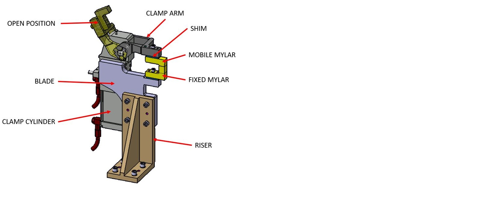
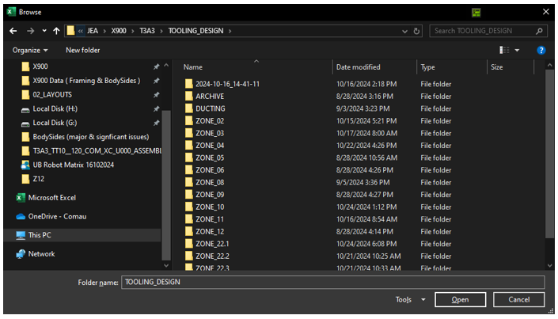
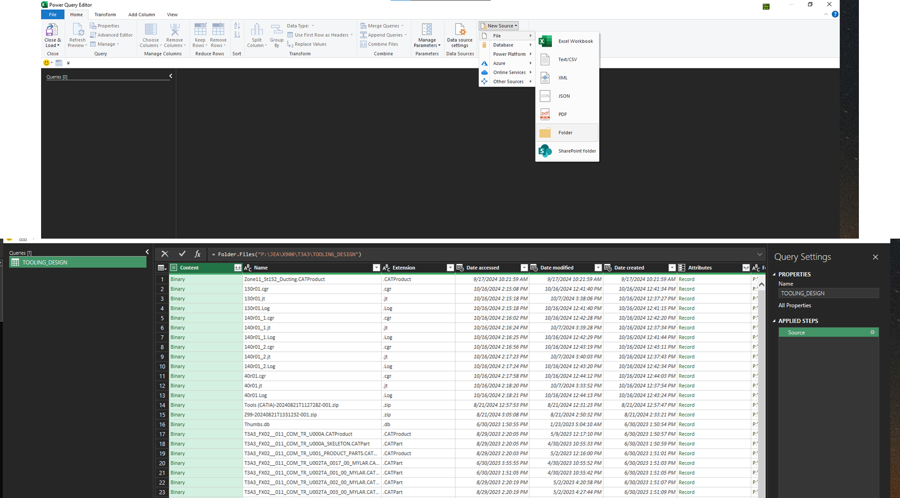
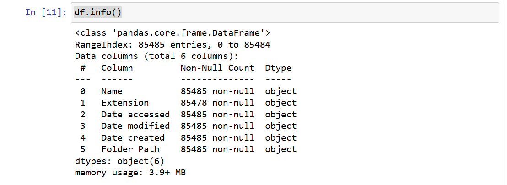
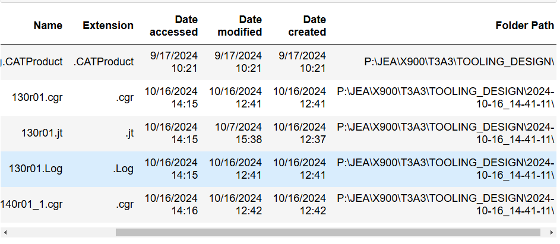

# Can we understand the number of Mylars of each zone and improve manufacturing lead time?
- In this task, we're trying to assist manufacturers in prioritizing by understanding the number of Mylars in each zone to enhance manufacturing lead time.
- Mylars are stored in the server as 3D CAT files with standardized names such as "T3A3_FX02__011_COM_TR_U002TA_0017_00_MYLAR.CATPart". Therefore, we can retrieve a list of Mylars.

## Getting the source file from the server
- Using PowerQuery , we can return a list of files of mylars from each Zone folder.
  

- Select new Source , from folder , select the main folder of the zones that have 3D CAD files
- Close & load the data. Save it as csv to analyse it with python

## Understanding our dataframe
- import the csv file with pandas
`df = pd.read_csv('Tooling_parts_list.csv')`
- how many rows and col ? `df.shape`    (85485, 6)

- infomration about column names `df.info()`
  

- `df.head()` to load first 5 col or `df.tail()` last 5 col to see what the dataframe looks like
  

