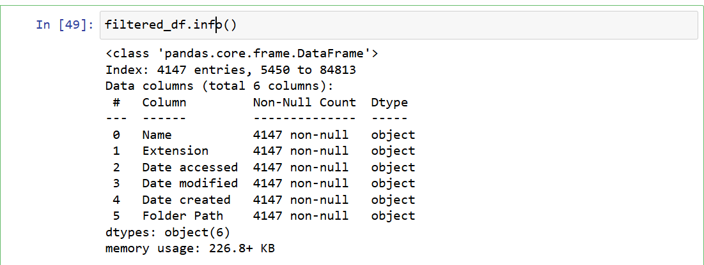
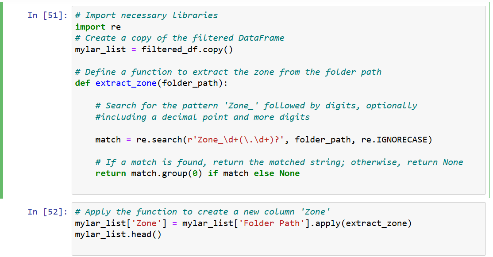
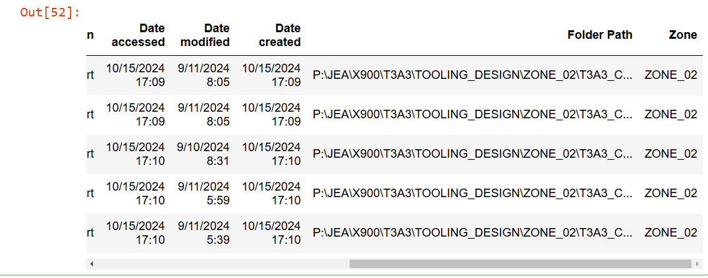
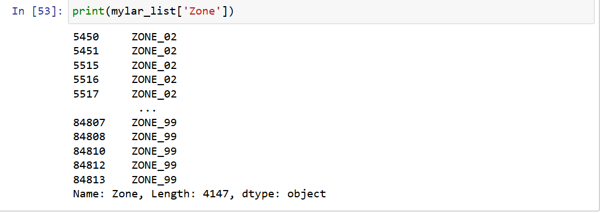
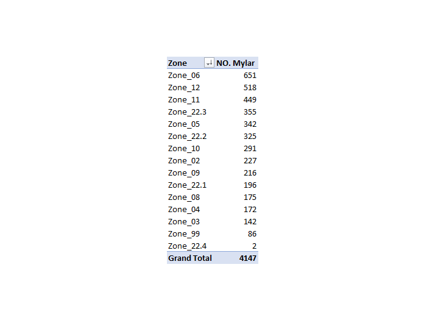
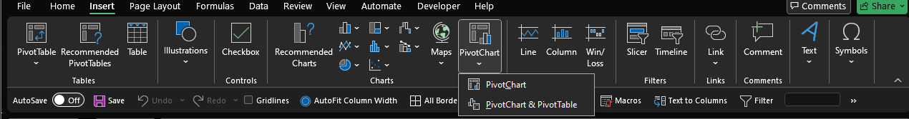

# Can we understand the total number of Mylars of each zone and improve manufacturing lead time?
- In this task, we're trying to assist manufacturers in prioritizing by understanding the number of Mylars in each zone to enhance manufacturing lead time.
- Mylars are stored in the server as 3D CAT files with standardized names such as "T3A3_FX02__011_COM_TR_U002TA_0017_00_MYLAR.CATPart". Therefore, we can retrieve a list of Mylars.

## Getting the source file from the server
- Using PowerQuery , we can return a list of files of mylars from each Zone folder.
  

- Select new Source , from folder , select the main folder of the zones that have 3D CAD files
- Close & load the data. Save it as csv to analyse it with python

## Dataframe preproessing and manipulation
- import the csv file with pandas
`df = pd.read_csv('Tooling_parts_list.csv')`
- how many rows and col ? `df.shape`    (85485, 6)

- infomration about column names `df.info()`
  

- `df.head()` to load first 5 col or `df.tail()` last 5 col to see what the dataframe looks like
  

- Column name should be filtered only files that contain the word "Mylar"
- Some folders should be filtered out of the col "Folder path" because it doesn't belong to one of the zone folder 
  - `mylar_files = df.copy()`
  - `search_pattern = 'ducting|archive|2024-10-16_14-41-11|New folder|OLD'`
  - exclude rows where the 'Folder Path' column contains a specified search_pattern, case-insensitively and ignoring NaN values. The ~ operator negates the condition, so it keeps rows that do not match the search_pattern
  - `filtered_df = df[df['Name'].str.contains('mylar' , case = False , na=False) & ~df['Folder Path'].str.contains( search_pattern, case = False , na = False) ] 
`
  - `filtered_df.info()`
  - Number rows dropped from 85,485 to 4147
  

- The Zone number can be extracted from col['Folder Path'] and add new col['Zone']
- That can be achieved with Regular expression operations libary

  

  

  

  - Exported it as csv file to create bar chart to display key metrics and data visually.
  - PivoteTable is created to get the sum of mylars for each zone
  

  - PivotChart is ceated
  
  

  

- Sum of all Mylars: 4,147

- Priority: Zone 06 should be pushed for manufacturing as early as possible because it has a significant number of Mylars to be produced.

- Quick Delivery: Zone 22.4 can be finished and delivered faster to the customer because it has the lowest number of Mylars.

- Total Count: The total number of Mylars for each zone was calculated.

